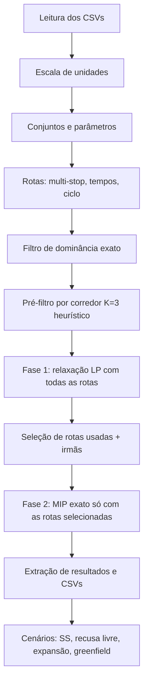

# RPVMM: documentação matemática e computacional

Roteirização e Programação de Venda, produção e Movimentação Marítima. Este documento descreve o que o arquivo `rpvmm.jl` faz, como o problema é formulado matematicamente e como a formulação é implementada e resolvida. A versão `rpvmm.jl` acrescenta restrições flexíveis, descritas na [seção 8](#8-restrições-flexíveis-rpvmmjl).

---

## Como rodar (guia rápido)

### 1. Preparar a pasta

Coloque na **mesma pasta** o script `rpvmm.jl` e todos os CSVs de entrada:

```
Projeto-RPVMM-main/
├── rpvmm.jl
├── MDClientes.csv        MDLocais.csv         MDProdutos.csv
├── MDArmadorRotas.csv    RDCapFabricas.csv    RDLocalProduto.csv
├── RDDemanda.csv         RDCustoInland.csv    RDEstoqueInicial.csv
├── RDFrota.csv           (opcional)
└── RDTransitoInicial.csv (opcional)
```

O script lê os arquivos da pasta onde ele está e grava os resultados em `saida/`, criada automaticamente.

### 2. Instalar os pacotes (só na primeira vez)

Abra o Julia (digite `julia` no terminal, dentro da pasta do projeto) e rode:

```julia
import Pkg
Pkg.activate(".")
Pkg.add(["JuMP", "HiGHS", "DataFrames", "CSV"])
```

`Statistics`, `LinearAlgebra` e `Unicode` já vêm com o Julia.

### 3. Fazer um teste rápido primeiro (recomendado)

O modelo completo demora dezenas de minutos por causa da fase 1. Antes disso, teste com uma versão reduzida. No início do arquivo `.jl`, altere:

```julia
const MODO_TESTE = true
```

Isso reduz instantes, rotas, produtos e clientes, e o modelo resolve em segundos. **Os resultados do modo teste não representam o problema real**: servem só para ver se o código roda e para ler as folgas.

### 4. Executar

**Opção A: terminal** (mais leve em memória). Abra o terminal na pasta do projeto e rode:

```
julia --project=. rpvmm.jl
```

**Opção B: REPL do Julia.** Troque `CAMINHO/DA/PASTA` pelo caminho da pasta onde você salvou os arquivos:

```julia
import Pkg
Pkg.activate("CAMINHO/DA/PASTA")
include("CAMINHO/DA/PASTA/rpvmm.jl")
```

Exemplos de caminho: `C:/Users/SEU_USUARIO/Documents/projeto` (Windows) ou `/home/usuario/projeto` (Linux/macOS). No Windows use `/` ou `\\` como separador, nunca uma `\` sozinha.

### 5. Ler o resultado

1. Veja no log o `Status` da fase 1 e da fase exata. O esperado é `OPTIMAL`.
2. Procure a linha **"Restrições flexíveis: folgas USADAS"**. Se aparecer, cada tipo de folga aponta uma restrição que estava impossível (veja a seção 8.5).
3. Abra `saida/base/resumo_financeiro.csv` para o lucro, e `saida/base/folgas_restricoes_flexiveis.csv` para o detalhe das folgas.
4. Se as folgas forem pequenas ou zero e o teste rodou bem, volte `MODO_TESTE = false` e rode o modelo completo.

### 6. Ajustes mais comuns

| Quero... | Mude |
|---|---|
| Voltar às restrições duras | `FLEXIBILIZAR = false` |
| Rodar cenários (estoque de segurança, recusa livre, expansão, greenfield) | `EXECUTAR_CENARIOS = true` |
| Modelo menor e mais rápido | `PREFILTRO_K` menor (ex.: 1) |
| Dar mais tempo ao solver | `TEMPO_LIMITE_FASE1_S` e `TEMPO_LIMITE_S` |
| Usar a frota real | Criar `RDFrota.csv` com `COD_ARMADOR` e `MAX_NAVIOS` |

**Requisito de memória:** o modelo completo é grande (na instância de referência usou cerca de 14 GB de RAM). Feche outros programas antes de rodar sem o modo teste.

---

## 1. Visão geral

### 1.1 O problema de negócio

Uma empresa produz produtos (famílias e linhas) em **fábricas**. Cada fábrica escoa sua produção por um **porto de origem (POL)**. Navios de **armadores** levam a carga dos POLs até **portos de destino (POD)**. Dos PODs, a carga segue por transporte terrestre (*inland*) até os **clientes**, que compram a um preço por tonelada.

O modelo decide, para cada mês do horizonte:

1. quanto cada fábrica produz de cada produto;
2. quantos navios de cada rota partem, e quanta carga de cada produto levam entre cada par POL→POD;
3. quanto se vende a cada cliente, por qual POD, e quanto fica em backlog (demanda atrasada) ou sem atendimento;
4. quanto estoque se mantém em cada local (fábrica, POL, POD), incluindo o estoque de segurança nos PODs.

O objetivo é **maximizar o lucro**: receita menos frete marítimo, custo inland, custo de estoque e penalidades de política.

### 1.2 Tipo de modelo

É um problema de **programação linear inteira mista (MILP)** de grande escala:

- variáveis contínuas para fluxos, estoques e vendas;
- variáveis **inteiras** para o número de navios por rota e mês;
- variáveis **binárias** para o desconto escalonado de frete (linearização por *big-M*).

No log da execução, o modelo completo tem ~1,6 milhão de variáveis, ~1,26 milhão de restrições e ~5,2 milhões de coeficientes não nulos. Por isso o código usa uma **estratégia em duas fases** (seção 6).

### 1.3 Fluxo de execução



---

## 2. Dados de entrada

| Arquivo | Conteúdo | Uso no modelo |
|---|---|---|
| `MDClientes.csv` | Clientes e flag `ATIVO` | Conjunto $C$ |
| `MDLocais.csv` | Locais, `TIPO` (Fabrica/POL/POD), calado, estoque máx., custo de estoque, capacidades de envio e recebimento (opcionais) | $L$, $F$, POL, POD, $\text{Emax}$, calado |
| `MDProdutos.csv` | Família, linha, `ATIVO` | Conjunto $P$ |
| `RDCapFabricas.csv` | `VOLUME_PRODUCAO` por fábrica e instante | $V_{f,t}$, horizonte $T$ |
| `RDLocalProduto.csv` | Quais fábricas produzem quais linhas (`PRODUZ`) | Conjunto $FP$ |
| `RDDemanda.csv` | Demanda e preço por cliente, produto e instante | $D_{c,p,t}$, $\pi_{c,p,t}$ |
| `RDCustoInland.csv` | Custo POD→cliente e quais PODs atendem cada cliente | $\kappa^{in}_{c,d}$, conjunto $CD$ |
| `RDEstoqueInicial.csv` | Estoque inicial por local e produto | $I^0_{l,p}$ |
| `MDArmadorRotas.csv` | Rotas: armador, origens e destinos (separados por `;`), tempo de ida, frete/ton, `MIN_INTAKE`, `MAX_INTAKE`; opcionais `TEMPO_VOLTA`, `TEMPO_PARADAS`, `MAX_NAVIOS` | Conjunto $R$ e parâmetros de rota |
| `RDFrota.csv` (opcional) | Limite de navios por armador (e por mês) | $\bar N_{a,t}$ |
| `RDTransitoInicial.csv` (opcional) | Carga que já saiu antes do horizonte, com instante de chegada | $Tr_{d,p,t}$ |

### 2.1 Escala de unidades

Para melhorar a numérica, tudo é reescalado:

- toneladas ficam em unidades de `ESCALA_TON = 1000` t (mil toneladas);
- moeda fica em unidades de `ESCALA_MOEDA = 1000`;
- preços e fretes por tonelada são multiplicados por $\text{ESCALA\_TON}/\text{ESCALA\_MOEDA}$.

Na saída, os valores voltam às unidades originais.

### 2.2 Mapeamento fábrica→POL

Cada fábrica $f$ escoa por exatamente um POL, $\text{POL}(f)$. O mapeamento vem de uma coluna de `MDLocais.csv` (`COD_POL`, `POL`, etc.). Se a coluna não existir, usa-se a tabela do enunciado (Suzano, Três Lagoas, Limeira e Jacareí → Santos; Mucuri, Aracruz e Veracel → Portocel; Imperatriz → Itaqui), casada por nome normalizado.

---

## 3. Notação matemática

### 3.1 Conjuntos

| Símbolo | Descrição |
|---|---|
| $T=\{t_0,\dots,t_N\}$ | Instantes (meses) do horizonte |
| $F,\ \text{POL},\ \text{POD}$ | Fábricas, portos de origem e portos de destino |
| $L = F\cup \text{POL}\cup \text{POD}$ | Locais com estoque |
| $C$ | Clientes ativos |
| $P$ | Produtos ativos (família, linha) |
| $A$ | Armadores |
| $FP\subseteq F\times P$ | Pares fábrica-produto permitidos |
| $CD\subseteq C\times \text{POD}$ | Pares cliente-POD com custo inland |
| $R$ | Rotas (após filtros) |
| $\Theta=\{(o,d,\ell)\}$ | **Trechos**: POL $o$, POD $d$, tempo de viagem $\ell$ |

### 3.2 Rotas multi-stop

Uma rota $r$ tem origens ordenadas $O_r=(o_1,\dots,o_{m})$ e destinos ordenados $D_r=(d_1,\dots,d_n)$. O navio carrega nas origens na ordem e descarrega nos destinos na ordem.

- **Defasagem de descarga** no destino $j$: $\ell_{r,j}$. Por padrão, $\text{base}_j=\lfloor \text{ida}\cdot j/n + 0{,}5\rfloor$, somado ao tempo de operação dos portos (`TEMPO_OPERACAO`, padrão 0). Exige-se $\ell_{r,1}\le\dots\le\ell_{r,n}$.
- **Ciclo** da rota: $\text{ciclo}_r=\max\big(1,\ \text{ida}+\text{volta}+\sum_{l\in O_r\cup D_r}\text{oper}_l\big)$. É o tempo que o navio fica ocupado após partir.
- **Segmentos viáveis** de $r$: $S_r=\{(k,j): \text{existe produto que pode ir de } o_k \text{ a } d_j\}$.
- **Segmentos por partida**: $S_{r,t}=\{(k,j)\in S_r : t+\ell_{r,j}\in T\}$. Só há variáveis onde a chegada cai dentro do horizonte.

Um produto $p$ pode fluir de $o$ para $d$ se estiver disponível em $o$ (produzido em fábrica que escoa por $o$, ou estoque inicial) e for demandado por algum cliente atendido por $d$. Isso define $\mathcal{P}(o,d)$.

### 3.3 Parâmetros

| Símbolo | Descrição |
|---|---|
| $D_{c,p,t}$ | Demanda do cliente $c$ pelo produto $p$ no mês $t$ (descarta $<1$ t) |
| $\pi_{c,p,t}$ | Preço de venda |
| $V_{f,t}$ | Volume de produção da fábrica $f$ (multiplicado por `fator_capacidade` nos cenários) |
| $I^0_{l,p}$ | Estoque inicial |
| $Tr_{d,p,t}$ | Trânsito inicial chegando ao POD $d$ no mês $t$ |
| $\text{Emax}_l$ | Capacidade de estoque do local $l$ |
| $\text{CapEnv}_o,\ \text{CapRec}_d$ | Capacidades mensais de envio e recebimento (opcionais) |
| $\text{DWT}_l$ | Calado (carga máxima do navio) no porto $l$ |
| $\phi_r$ | Frete por tonelada da rota $r$ |
| $\underline{Q}_r,\ \overline{Q}_r$ | `MIN_INTAKE` e `MAX_INTAKE` por navio |
| $\bar N_{a,t}$ | Frota máxima do armador $a$ no mês $t$; $\hat N_a=\max_t \bar N_{a,t}$ |
| $\kappa^{in}_{c,d}$ | Custo inland por tonelada |
| $h_l$ | Custo de estoque por tonelada-mês no local $l$ |
| $\lambda^{bl},\lambda^{ss},\lambda^{sp},\lambda^{bal}$ | Penalidades de backlog, estoque de segurança, spot e balanceamento |
| $\gamma=\text{dias\_ss}/30$ | Cobertura de segurança em meses |

Os custos de estoque e as penalidades são **placeholders**, definidos como percentual do preço médio $\bar\pi$ quando o dado real não existe:

| Item | Percentual de $\bar\pi$ |
|---|---|
| Estoque em fábrica | 1,0% |
| Estoque em POL | 0,6% |
| Estoque em POD | 0,3% |
| Backlog | 2% |
| Estoque de segurança | 5% |
| Spot | 30% |

Por isso o código recomenda interpretar o **lucro operacional** e não o objetivo.

### 3.4 Faixas de frete (desconto por ocupação)

`FAIXAS_FRETE` define três faixas de ocupação do navio, com desconto crescente:

| Faixa $k$ | Ocupação $[lo_k,hi_k]$ | Desconto $\delta_k$ |
|---|---|---|
| 1 | 0% a 50% | 0% |
| 2 | 50% a 75% | 10% |
| 3 | 75% a 100% | 25% |

---

## 4. Modelo matemático

### 4.1 Variáveis de decisão

**Produção e estoque**

| Variável | Domínio | Significado |
|---|---|---|
| $q_{f,p,t}$ | $\ge 0$, $(f,p)\in FP$ | Produção |
| $w_{f,p,t}$ | $\ge 0$ | Envio da fábrica ao POL |
| $e_{l,p,t}$ | $\ge 0$ | Estoque no fim do mês |
| $\text{ld}_{o,p,t}$ | $\ge 0$ | Carga embarcada no POL $o$ |
| $\text{ul}_{d,p,t}$ | $\ge 0$ | Carga descarregada no POD $d$ |

**Vendas, backlog e coortes de preço**

| Variável | Significado |
|---|---|
| $s_{c,d,p,t}$ | Venda ao cliente $c$ via POD $d$ |
| $b_{c,p,t}$ | Backlog (demanda acumulada não atendida) |
| $\text{sp}_{c,p}$ | Demanda não atendida ao final do horizonte ("spot") |
| $a_{c,p,\tau,t}$ | Demanda do mês $\tau$ atendida no mês $t\ge\tau$ (só onde o preço varia no tempo) |
| $\sigma_{d,p,t}\ge 0$ | Folga do estoque de segurança (violação penalizada) |

**Transporte**

| Variável | Domínio | Significado |
|---|---|---|
| $n_{r,t}$ | inteira, $0\le n\le \hat N_{a(r)}$ | Navios da rota $r$ que partem em $t$ |
| $y_{r,k,j,t}$ | $\ge 0$ | Toneladas de $o_k$ para $d_j$ na viagem |
| $\varphi_{r,t,\kappa}$ | $\ge 0$ | Toneladas que caem na faixa de frete $\kappa$ |
| $z_{r,t,\kappa}$ | binária, $\kappa\ge 2$ | Indica que a faixa $\kappa$ está ativa |
| $x_{i,p,t}$ | $\ge 0$ | Produto $p$ no trecho $i\in\Theta$ partindo em $t$ |

### 4.2 Função objetivo

$$
\max\ \ \underbrace{\sum \pi\, s + \sum \pi_{c,p,\tau}\, a}_{\text{receita}}
\;-\; \underbrace{\sum_{r,t,\kappa}\phi_r(1-\delta_\kappa)\,\varphi_{r,t,\kappa}}_{\text{frete marítimo}}
\;-\; \underbrace{\sum \kappa^{in}_{c,d}\, s_{c,d,p,t}}_{\text{inland}}
\;-\; \underbrace{\sum_{l,p,t} h_l\, e_{l,p,t}}_{\text{estoque}}
\;-\; \text{Pen}
$$

$$
\text{Pen}=\lambda^{bl}\!\!\sum_{t<t_N}\! b_{c,p,t}+\lambda^{ss}\!\sum \sigma+\lambda^{sp}\!\sum \text{sp}_{c,p}+\lambda^{bal}\!\sum \text{mean}(\text{req})\,(c^{max}-c^{min})
$$

- Pares $(c,p)$ que **não** têm preço variável usam receita $\pi_{c,p,t}\,s$ no mês da venda.
- Pares com preço variável (coortes, `PRECO_POR_COORTE = true`) usam $\pi_{c,p,\tau}\,a_{c,p,\tau,t}$: **demanda atrasada é vendida ao preço do mês da demanda**, não ao do mês da entrega.
- Se `VALOR_RESIDUAL_PCT > 0`, soma-se o valor do estoque final dos PODs. O padrão é 0.
- No cenário `recusa_livre`, $\lambda^{bl}=\lambda^{sp}=0$: o modelo pode recusar clientes sem custo, o que revela os deficitários.

### 4.3 Restrições

**(R1) Balanço na fábrica**

$$
e_{f,p,t}=e_{f,p,t-1}+q_{f,p,t}-w_{f,p,t},\qquad e_{f,p,t_0-1}=I^0_{f,p}
$$

**(R2) Capacidade de produção (100% utilizada)**

$$
\sum_{p:(f,p)\in FP} q_{f,p,t}=V_{f,t}
$$

Em `MODO_TESTE` a igualdade vira $\le$.

**(R3) Balanço no POL**

$$
e_{o,p,t}=e_{o,p,t-1}+\sum_{f:\text{POL}(f)=o}w_{f,p,t}-\text{ld}_{o,p,t}
$$

Com `FABRICA_POL_MESMO_MES = true` o envio fábrica→POL é instantâneo, e $e\ge 0$ já limita a carga ao disponível. Caso contrário, adiciona-se $\text{ld}_{o,p,t}\le e_{o,p,t-1}$.

**(R4) Balanço no POD**

$$
e_{d,p,t}=e_{d,p,t-1}+\text{ul}_{d,p,t}-\sum_{c:(c,d)\in CD}s_{c,d,p,t}
$$

**(R5) Conservação de demanda com backlog**

$$
b_{c,p,t}=b_{c,p,t-1}+D_{c,p,t}-\sum_{d}s_{c,d,p,t},\qquad b_{c,p,t_0-1}=0,\qquad \text{sp}_{c,p}=b_{c,p,t_N}
$$

**(R6) Coortes de preço** (só para $(c,p)$ com preço variável)

$$
\sum_d s_{c,d,p,t}=\sum_{\tau\le t}a_{c,p,\tau,t},\qquad \sum_{t\ge\tau}a_{c,p,\tau,t}\le D_{c,p,\tau}
$$

**(R7) Estoque de segurança no POD**

Com `BASE_ESTOQUE_SEGURANCA = :vendas`, a exigência é de $\gamma$ meses das **vendas reais** do mês seguinte (linear nas variáveis):

$$
e_{d,p,t}+\sigma_{d,p,t}\ \ge\ \gamma\sum_{c}s_{c,d,p,t+1}\qquad(\text{em } t=t_N \text{ usa } t_N)
$$

Com `:demanda_igual`, o lado direito é $\gamma\cdot$(demanda do cliente dividida igualmente entre seus PODs).

**(R8) Balanceamento de cobertura entre PODs** (penalidade suave)

Para cada produto e mês, entre PODs com demanda planejada $\ge$ 500 t:

$$
c^{max}\ge \frac{e_{d,p,t}}{\text{req}_{d}},\qquad c^{min}\le \frac{e_{d,p,t}}{\text{req}_{d}}
$$

A penalidade $\lambda^{bal}\,\text{mean}(\text{req})\,(c^{max}-c^{min})$ empurra os PODs a terem coberturas parecidas.

**(R9) Capacidade de estoque**

Fim do mês:

$$
\sum_p e_{l,p,t}\le \text{Emax}_l
$$

Pico (`RESTRINGIR_PICO_ESTOQUE`), estoque anterior somado à entrada do mês:

$$
\sum_p\big(e_{d,p,t-1}+\text{ul}_{d,p,t}\big)\le \text{Emax}_d,\qquad
\sum_p\Big(e_{o,p,t-1}+\sum_{f:\text{POL}(f)=o}w_{f,p,t}\Big)\le \text{Emax}_o
$$

**(R10) Capacidades de porto** (só se as colunas existirem)

$$
\sum_p \text{ld}_{o,p,t}\le \text{CapEnv}_o,\qquad \sum_p \text{ul}_{d,p,t}\le \text{CapRec}_d
$$

**(R11) Intake e calado por viagem.** Seja $Y_{r,t}=\sum_{(k,j)\in S_{r,t}}y_{r,k,j,t}$ o total transportado.

$$
\underline{Q}_r\, n_{r,t}\le Y_{r,t}\le \overline{Q}_r\, n_{r,t}
$$

Calado nos POLs, respeitando a ordem de carregamento (a carga acumulada até a origem $k$ não excede o calado dessa origem):

$$
\sum_{(k',j)\in S_{r,t},\,k'\le k}y_{r,k',j,t}\le \text{DWT}_{o_k}\,n_{r,t}
$$

Calado nos PODs, com `CALADO_DESCARGA_POR_PARADA = true` (o navio que chega ao destino $j$ ainda carrega tudo o que vai para $j$ e adiante):

$$
\sum_{(k,j')\in S_{r,t},\,j'\ge j}y_{r,k,j',t}\le \text{DWT}_{d_j}\,n_{r,t}
$$

**(R12) Frete escalonado.** Com $\text{cap}=\overline{Q}_r\,n_{r,t}$:

$$
\sum_{\kappa}\varphi_{r,t,\kappa}=Y_{r,t},\qquad \varphi_{r,t,\kappa}\le (hi_\kappa-lo_\kappa)\,\text{cap}
$$

O desconto cresce com a ocupação, então o frete efetivo é **côncavo** no volume. Um otimizador de minimização de custo tenderia a colocar todo o volume na faixa mais barata (a 3). Para forçar o preenchimento em ordem, usa-se *big-M* com binárias, com $M_\kappa=(hi_\kappa-lo_\kappa)\,\overline{Q}_r\,\hat N_{a}$:

$$
\varphi_{r,t,\kappa}\le M_\kappa z_{r,t,\kappa},\qquad
\varphi_{r,t,\kappa-1}\ge (hi_{\kappa-1}-lo_{\kappa-1})\,\text{cap}-M_{\kappa-1}(1-z_{r,t,\kappa}),\qquad z_{r,t,\kappa}\le z_{r,t,\kappa-1}
$$

Ou seja, a faixa $\kappa$ só pode ter volume se a faixa $\kappa-1$ estiver cheia.

> **Premissa:** os navios de uma mesma (rota, mês) carregam igual. A ocupação é $Y/(\overline{Q}_r\,n)$.

**(R13) Ligação rota↔trecho.** Cada segmento $(k,j)$ de $r$ corresponde ao trecho $i=(o_k,d_j,\ell_{r,j})$:

$$
\sum_{p\in\mathcal P(o,d)}x_{i,p,t}=\sum_{r,(k,j):\,(o_k,d_j,\ell_{r,j})=i}y_{r,k,j,t}
$$

**(R14) Ligação trecho↔estoques dos portos**

$$
\text{ld}_{o,p,t}=\sum_{i:\,o(i)=o}x_{i,p,t},\qquad
\text{ul}_{d,p,\tau}=\sum_{i:\,d(i)=d,\ t+\ell_i=\tau}x_{i,p,t}+Tr_{d,p,\tau}
$$

**(R15) Frota por armador e mês.** Um navio que parte em $t_s$ fica ocupado durante o ciclo:

$$
\sum_{r:\,a(r)=a}\ \sum_{t_s:\ t_s\le t\le t_s+\text{ciclo}_r-1}n_{r,t_s}\le \bar N_{a,t}
$$

### 4.4 Ideia central: fluxo por trecho, não por rota

Em vez de indexar o produto por rota, o modelo agrega o produto por **trecho** $(o,d,\ell)$. Rotas diferentes que compartilham um trecho somam suas toneladas em $x$. Isso reduz muito o número de variáveis de produto: $x$ tem ~67 mil variáveis contra ~93 mil de $y$, e sem essa agregação seria da ordem de $|R|\times|P|\times|T|$.

---

## 5. Implementação computacional

### 5.1 Estrutura de `rpvmm.jl`

| Bloco | O que faz |
|---|---|
| Parâmetros gerais | Constantes globais (`const`) de tempo, gap, estratégia, escalas, cenários |
| `Cenario` | `struct` com nome, dias de estoque de segurança, clientes excluídos, fator de capacidade por fábrica, flag `recusar_livre`, rotas extras |
| Leitura | `ler`, `converte_num` (aceita vírgula decimal), `exigir` (valida colunas) |
| Escala | `escalar!` converte toneladas e moeda |
| Conjuntos e parâmetros | Monta $F$, POL, POD, $C$, $P$, $FP$, $CD$, dicionários de demanda, preço, estoque etc. |
| Frota | Lê `RDFrota.csv` ou `MAX_NAVIOS`; sem dado usa 5 navios/armador (aviso) |
| Rotas | Parse de `;`, cálculo de `lag_desc` e `ciclo` |
| Filtros | `filtrar_dominancia` (exato) e `prefiltro_por_corredor` (heurístico) |
| `construir_modelo` | Cria o modelo JuMP/HiGHS: variáveis, restrições e objetivo |
| `extrair_resultado` | Converte a solução em tabelas (DataFrames) e resumo |
| `resolver` | Orquestra fase 1 e fase 2 |
| Greenfield | `ajusta_frete`, `estimar_greenfield`, `analisar_greenfield` |
| `executar_cenarios` | Roda os cenários comparativos |

### 5.2 Filtros de rotas

1. **Dominância exata** (`FILTRO_DOMINANCIA`). Duas rotas com o mesmo armador, origens, destinos (na ordem), tempos, ciclo e intake são equivalentes, exceto pelo frete. Mantém-se a mais barata. Isso não muda o ótimo: no log, 10117 → 10095 rotas.
2. **Pré-filtro por corredor** (`PREFILTRO_K = 3`). Para cada corredor (armador, POL, POD, tempo de chegada, ciclo, intake) mantêm-se as $K$ rotas mais baratas. É **heurístico**: pode descartar uma rota que seria necessária para atender demanda ou escoar produção. No log, 10095 → 2293 rotas. A função `sensibilidade_prefiltro()` mede o efeito rodando com $K\in\{1,3,5,\infty\}$.

### 5.3 Esparsidade

As variáveis só são criadas onde fazem sentido:

- $q$ e $w$ só para $(f,p)\in FP$;
- $s$ só para $(c,p)$ com demanda e $(c,d)\in CD$;
- $a$ só para $t\ge\tau$ e apenas em pares com preço variável;
- $y,\ n,\ \varphi,\ z$ só para $(r,t)$ com algum segmento cuja chegada cai no horizonte;
- $x$ só para trechos e produtos viáveis, com chegada em $T$.

O código estima o total de variáveis antes de construir e aborta se passar de `MAX_VARIAVEIS` (4 milhões).

### 5.4 Solver

O modelo é construído com `direct_model(HiGHS.Optimizer())` e nomes desligados, para economizar memória.

| Fase | Solver | Configuração |
|---|---|---|
| Relaxação (fase 1) | HiGHS, `ipm` (ou `simplex` em `MODO_TESTE`) | `run_crossover` conforme `IPM_CROSSOVER` |
| MIP (fase 2) | HiGHS branch-and-cut | `mip_rel_gap = 1%`, `mip_heuristic_effort = 0,3`, limite de tempo `TEMPO_LIMITE_S` |

Uma nota sobre os limites de tempo: `TEMPO_LIMITE_FASE1_S` (3600 s) e `TEMPO_LIMITE_S` (3600 s) são independentes. Os cenários usam `TEMPO_LIMITE_CENARIO_S` (900 s).

---

## 6. Estratégia em duas fases

Resolver o MILP completo (todas as rotas, inteiras e binárias) é inviável. O código faz:

**Fase 1: relaxação linear (LP).** Relaxam-se $n\in\mathbb Z$ e $z\in\{0,1\}$ para contínuos em $[0,\hat N]$ e $[0,1]$, e resolve-se com **todas** as rotas. Como o problema é de maximização, o valor da relaxação é um **limite superior** $UB$ do lucro ótimo (sobre o conjunto de rotas pós-pré-filtro).

**Seleção de rotas.** Uma rota é "usada" se $\max_t n_{r,t}>10^{-3}$ (`LIMIAR_USO_ROTA`). Com `INCLUIR_IRMAS`, adicionam-se as rotas com mesmo (armador, origens, destinos), para dar alternativas de frete e tempo ao MIP.

**Fase 2: MIP exato.** Reconstrói-se o modelo só com as rotas selecionadas, agora com inteiras e binárias, e resolve-se até `GAP_MIP` ou o limite de tempo.

**Distância certificada ao ótimo.**

$$
\text{dist}=100\cdot\frac{UB-\text{lucro}_{MIP}}{|UB|}
$$

Esse número inclui o gap de integralidade e o efeito de ter podado rotas, mas **não** o efeito do pré-filtro K, que já está dentro do $UB$.

---

## 7. Saídas e cenários

### 7.1 Tabelas exportadas (`saida/<cenário>/`)

`producao_fabrica`, `viagens_por_rota`, `viagens_segmentos`, `fluxo_produto_por_trecho`, `estoque_por_local`, `atendimento_cliente`, `cliente_por_porto`, `rentabilidade_clientes`, `violacao_estoque_seguranca`, `backlog`, `resumo_financeiro` e `resumo_cenario`.

### 7.2 Lucro operacional vs. objetivo

$$
\text{Lucro operacional}=\text{receita}+\text{residual}-\text{frete}-\text{inland}-\text{estoque}
$$

$$
\text{Lucro (objetivo)}=\text{Lucro operacional}-\text{Pen}
$$

Como $\text{Pen}$ usa placeholders, o lucro operacional é o indicador mais confiável.

### 7.3 Rentabilidade por cliente

O frete de cada viagem é rateado entre clientes pela média do POD, e a margem é $\text{receita}-\text{inland}-\text{frete alocado}$. Clientes com margem negativa são marcados com `PREJUIZO`.

### 7.4 Cenários (`EXECUTAR_CENARIOS = true`)

Os cenários reusam as rotas da base (`rotas_pre`), dispensando a fase 1:

| Cenário | Alteração | Pergunta respondida |
|---|---|---|
| `ss_10d`, `ss_5d`, `ss_0d` | $\gamma$ menor | Quanto vale reduzir o estoque de segurança de 15 dias? |
| `recusa_livre` | $\lambda^{bl}=\lambda^{sp}=0$ | Quais clientes o modelo prefere não atender? |
| `exp_<fábrica>` | $V_{f,t}\times 1{,}2$ | Qual o valor por tonelada adicional produzida em cada fábrica? |
| `greenfield` | Adiciona rotas novas estimadas | Vale abrir corredores POL→POD sem rota hoje? |

O valor da expansão é $\Delta\text{lucro}/(\text{ton adicionais})$, com ranking por fábrica.

### 7.5 Greenfield: estimativa de rotas novas

Para corredores $(o,d)$ sem nenhuma rota observada:

1. **Tempo de viagem** por mínimos quadrados com a estrutura aditiva $\text{tempo}(o,d)\approx a_o+b_d$, resolvida com pseudo-inversa: $\beta=X^{+}y$.
2. **Frete** por armador: regressão linear $\phi\approx\beta_0+\beta_1\cdot\text{tempo}$. Se o armador tiver menos de 4 observações, usa-se a regressão agregada.
3. **Frete final**: $\max(\hat\phi,\ 0{,}5\min\phi_{obs})\cdot(1+m)$, com $m=$ `MARGEM_GREENFIELD` = 10% de prêmio de segurança.
4. Escolhe-se o armador mais barato por corredor e limita-se a `GREENFIELD_MAX_CANDIDATAS` = 200.

Os fretes dessas rotas são **estimados**, então o resultado deve ser lido com cautela e testado com margens maiores.

---

## 8. Restrições flexíveis (`rpvmm.jl`)

### 8.1 Por que a versão original ficou infactível

No log da execução, o HiGHS (via HiPO e IPX) terminou com `Model status: Infeasible`. O problema **não** era tempo. Há restrições duras que competem entre si:

- A produção é **forçada a 100%** do volume (R2).
- O estoque tem **teto duro** (R9), tanto no fim do mês quanto no pico.
- O escoamento depende de frota (R15), calado (R11) e de o pré-filtro K=3 não ter cortado rotas necessárias.
- O trânsito inicial é descarga obrigatória (R14), e pode estourar a capacidade do porto.

Se a produção obrigatória não consegue sair, o estoque estoura o teto e o modelo é infactível.

### 8.2 Formulação elástica

Cada restrição dura foi substituída por uma versão com **folga não negativa penalizada**. Com $\varepsilon\ge 0$ as variáveis de folga:

| Restrição | Versão flexível | Penalidade (por unidade) |
|---|---|---|
| R2 produção | $\sum_p q_{f,p,t}+\varepsilon^{ocio}_{f,t}=V_{f,t}$ | $0{,}5\,\bar\pi$ por ton ociosa |
| R9 estoque fim do mês | $\sum_p e_{l,p,t}\le \text{Emax}_l+\varepsilon^{est}_{l,t}$ | $1{,}0\,\bar\pi$ por ton |
| R9 estoque no pico | $\dots\le \text{Emax}_l+\varepsilon^{pico}_{l,t}$ | $1{,}0\,\bar\pi$ por ton |
| R10 envio e recebimento | $\dots\le \text{Cap}+\varepsilon^{env/rec}$ | $1{,}0\,\bar\pi$ por ton |
| R15 frota | $\dots\le \bar N_{a,t}+\varepsilon^{frota}_{a,t}$ | $1{,}0\,\bar\pi\cdot\overline{\overline{Q}}$ por navio-mês |

O objetivo passa a subtrair $\sum \text{pen}\cdot\varepsilon$ (`pen_flex`). A penalidade de frota é a receita de uma carga média, o que a torna maior que a margem de qualquer viagem. Ela só será "paga" quando não houver alternativa.

### 8.3 Propriedade computacional

Com essas folgas o modelo tem **recurso completo relativo**: $q=0$ (tudo em ociosidade), $n=0$, $s=0$ e estoques iniciais dentro das folgas formam sempre uma solução viável. Portanto:

- a fase 1 nunca deve reportar `INFEASIBLE` por conta de capacidade;
- as folgas **positivas na solução apontam exatamente qual restrição estava impossível**, em qual local e em qual mês.

### 8.4 Higiene numérica

O HiGHS avisou `excessively small row bounds` (RHS ≈ $5\times10^{-5}$). Valores abaixo de `LIMIAR_RHS = 1e-4` (em unidades escaladas, ou seja 0,1 t) em demanda, estoque inicial, trânsito e volume de produção são arredondados para 0.

### 8.5 Como ler o diagnóstico

O log imprime as folgas usadas por tipo (total e maior ocorrência), e `folgas_restricoes_flexiveis.csv` lista tipo, chave e valor. Uma leitura típica:

| Folga dominante | Interpretação provável |
|---|---|
| `prod_ociosa` alta | A produção obrigatória não escoa: falta rota, frota ou capacidade de porto |
| `cap_estoque` / `cap_pico` no POL | Gargalo de escoamento da fábrica; verifique frota e rotas do POL |
| `cap_pico` no POD | Trânsito inicial ou estoque inicial acima do teto do POD |
| `frota` | A frota do armador (5 por padrão, sem dado real) é insuficiente |

---

## 9. Premissas e limitações

1. **Discretização mensal.** Tempos de viagem são arredondados para meses inteiros (meio para cima).
2. **Efeito de fim de horizonte.** Só existem viagens cuja chegada cai dentro de $T$; carga que partiria tarde demais é impedida.
3. **Navios com carga igual** dentro de uma (rota, mês) para o cálculo de ocupação e faixa de frete.
4. **Frota arbitrária.** Sem `RDFrota.csv` nem `MAX_NAVIOS`, todos os armadores têm 5 navios. Isso costuma ser o parâmetro mais sensível.
5. **Custos de estoque e penalidades são placeholders** em % do preço médio.
6. **Pré-filtro K é heurístico** e não tem garantia de otimalidade.
7. **Capacidades de envio e recebimento** só valem se as colunas existirem em `MDLocais.csv` (no log, não existiam).
8. **Estoque de segurança** depende das vendas do mês seguinte (linear), o que é uma aproximação da política real.
9. **Greenfield** usa regressões com poucos dados, com erro padrão registrado em `greenfield_candidatas.csv`.

---

## 10. Guia rápido de parâmetros

| Constante | Padrão | Efeito |
|---|---|---|
| `ESTRATEGIA` | `:duas_fases` | `:direto` resolve uma vez com todas as rotas |
| `PREFILTRO_K` | 3 | 0 desliga; maior = mais rotas, modelo maior |
| `FROTA_MAX_POR_ARMADOR` | 5 | Usado só sem dado de frota |
| `MODO_TESTE` | `false` | `true` reduz instantes, rotas, produtos e clientes para depurar em segundos |
| `DIAS_ESTOQUE_SEGURANCA` | 15 | Cobertura $\gamma\cdot 30$ |
| `GAP_MIP` | 1% | Tolerância do MIP |
| `FLEXIBILIZAR` | `true` (flex) | `false` volta às restrições duras |
| `PCT_PEN_CAP_ESTOQUE` etc. | 1,0 | Custo das folgas; aumentar força o modelo a respeitar capacidades |
| `EXECUTAR_CENARIOS` | `false` | Roda SS, recusa livre, expansão e greenfield |

**Roteiro de depuração recomendado:** (1) `MODO_TESTE = true` com `FLEXIBILIZAR = true`; (2) ler as folgas usadas; (3) corrigir dados ou parâmetros apontados; (4) rodar o modelo completo.